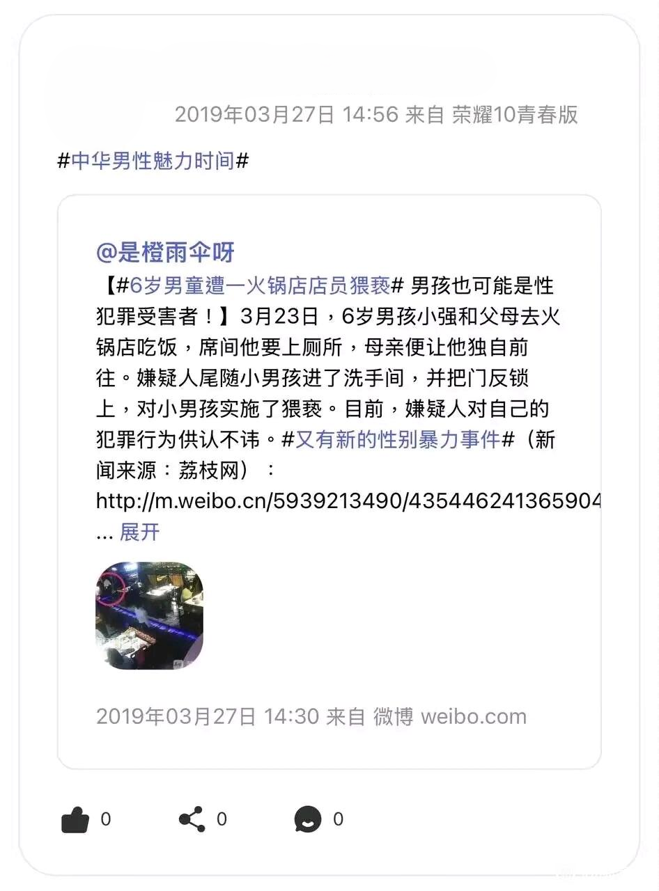

你可以在[这里](https://github.com/Yuhanawa/VTuber.ICU-Content/edit/master/v/扇宝/index.md)编辑本文

虚环中扇宝的形象

## 出道

<!--  -->

可爱捏

## 事件

### “开盒”事件

> 本站保持中立，尊重他人合法权益，营造一个健康、积极的网络环境，共同守护所热爱的虚拟世界
> 如果部分内容无意冒犯到了您，请[在此](https://github.com/Yuhanawa/VTuber.ICU-Content/issues/new)反馈，谢谢！

2024年10月8日
黑产通过星瞳和扇宝在泰国旅游的信息，开盒了扇宝，并进行了开盒预告
10月10日
扇宝中之人一些个人信息被爆出，包括证件照，姓名，身份证号，户籍，教育经历，电话号码，QQ，微信，微博，贴吧等

其中扇宝在微博账号上的一些内容引起了一些争议

#### 事件初始

2024年10月10日

##### 主播反应

2024年10月10日 18:32
扇宝在B站发布[动态声明](https://www.bilibili.com/opus/986631022477049864):

> 声明
>
> 针对近期**中之人“开盒”事件**，我们强烈谴责任何对个人隐私信息恶意盗取，并在网络平台捏造、发布和传播的行为。该行为损害了扇宝的形象与声誉，更触碰了社会对于个人隐私保护的底线。
>
> **个人隐私是国家赋予每个公民的基本权利**，不法分子通过非法手段获取并泄露个人隐私信息，违反了《中华人民共和国网络安全法》、《中华人民共和国个人信息保护法》等相关法律法规。对于此类违法行为，无论传播信息是否属实，我们都将坚决依法追究其法律责任，维护扇宝的合法权益。
> **个人隐私理应得到充分的尊重与保护**，任何形式的泄露、传播或利用他人隐私信息的行为，都是对社会公序良俗的严重挑战，是对我们共同构建的文明、和谐社会的破坏。同时，此次事件也严重地影响了中之人的正常工作和生活，为有效防止类似事件再次发生，我司将进一步加强个人信息的安全防护工作，确保所有与扇宝相关的信息都能得到严格、妥善的管理。同时，我司也会时刻关注扇宝的身心健康，并采取一切必要措施保护扇宝的人身安全。
>
> **我们在此呼吁广大网友能够理性看待此事，不传播、不评论、不参与，尊重他人合法权益，共同营造一个健康、积极的网络环境。**
>
> 对于此次事件，TME也将联手CDD一同开展联合调查，多案并举，通过法律途径，坚决追究不法分子的法律责任。同时，我们也呼吁广大网友积极提供线索，共同打击此类违法犯罪行为。
>
> 举报内容包括但不限于：
>
> 1、在网络或社区中传播有关户头、证件、证件照、社保等隐私信息的证据截图或录屏
> 2、传播者的个人IP与账号ID
> 3、造谣、辱骂等相关文字信息的截图（包含2提及的账号信息）
> 举报邮箱地址：xtservice@tencent.com
>
> 最后，衷心感谢所有关注和支持扇宝的朋友们。在未来的日子里，我们将继续致力于为大家带来更加精彩、优质的虚拟偶像体验。同时，我们也期望与大家一同**守护所热爱的虚拟世界。**

_粗体为本站添加，仅为更好的阅读体验_

##### 粉丝评论

##### 机器人评论

#### "死亡公关"

##### [今晚8点](https://www.bilibili.com/opus/986651135804702739)

##### 粉丝评论

##### 直播回应

在直播中，扇宝并没有选择原地滑跪和闷头装死，而是进行了一场“死亡公关”

扇宝在面对SC的质问时，没有否认，也没有道歉，而是说教

在面对"为什么诅咒别人家小孩"的质问时，扇宝“你家小孩吗？”的回答基本上宣布了这场直播不可能"翻盘"

#### 收尾

2024年10月11日 18:01 扇宝发布了动态"致带扇人"并将其置顶，截至本文更新时，此动态为扇宝的最新动态

##### 粉丝评论

## 参考链接

[扇宝B站个人主页](https://space.bilibili.com/698438232/)

[9分钟带你回顾扇宝10.10直播的回应](https://www.bilibili.com/video/BV1M72kYsEKp/)

[微博打拳辱骂男性诅咒小孩，直播大搞软色情玩情趣PLAY？你们有没有这样的虚拟主播啊？](https://www.bilibili.com/video/BV1Pd2iYNEZD/)

[幽默扇宝 史诗级公关和说教](https://www.bilibili.com/video/BV1yK2CYDECs)

[星瞳死扇宝亦死 全灭《虚环》五姐妹](https://zhuanlan.zhihu.com/p/928041348)
